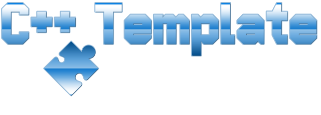

# PongFree

[](https://github.com/tomasmark79/PongFree/actions/workflows/ubuntu.yml)
[](https://github.com/tomasmark79/PongFree/actions/workflows/macos.yml)
[](https://github.com/tomasmark79/PongFree/actions/workflows/windows.yml)  

https://github.com/user-attachments/assets/f5550adc-12b4-41a3-afc2-fb1ba3bc1e31
https://github.com/user-attachments/assets/13107b46-b82a-4ec1-8b89-7ea7b8fb81ee




---

## Overview  
DotName C++ Template is a comprehensive, modern C++ project template designed for cross-platform development in Visual Studio Code. The template provides a robust foundation for both standalone executables and libraries, incorporating industry best practices and modern build tools.

- In the `(🚀 Free) version`, the template provides comprehensive essential C++ source code and configurations for a successful project build.

- In the `(🛸 Pro) version`, significantly expanded development, automation, and overall comfort options are available.

## Free 🚀 Key Features

- Works in **Linux**, **MacOS**, **Windows**
- Modern projects design **Standalone** & **Library**
  - With integrated wrappers [**CPM.cmake**](https://github.com/cpm-cmake/CPM.cmake), [**CPM.license**](https://github.com/cpm-cmake/CPMLicenses.cmake)
  - With integrated basic [**cxxopt**](https://github.com/jarro2783/cxxopts/tree/v3.2.1) ([cxxoptwiki](https://github.com/jarro2783/cxxopts/wiki))
- **Conan 2** ready conanfile.py
- Predefined GitHub [Actions](https://docs.github.com/en/actions) workflows for continuous integration
- Provided basic commands for **installing**, **configuring**, **building**, and **installing** the project via *CLI*.

## Pro 🛸 Key Features
- Initializer (Installers) scripts (Debians, Fedoras, Windows)
- Keybindings definitions for implemented [VSCode Tasks](https://code.visualstudio.com/docs/editor/tasks)
- Integrated VSCode WorkFlow via **SolutionController.py**
- Wrapped automatic CMake **Native Build** support with Conan profiles
- Wrapped automatic CMake **Cross Build** support with Conan profiles
- Integrated Template Renamer by **SolutionRenamer.py**
- Integrated Template Upgrader by **SolutionUpgrader.py**
- Integrated Solution.log
- Integrated **Native C++ debugging** in VSCode by Microsoft [C++ extension](https://marketplace.visualstudio.com/items?itemName=ms-vscode.cpptools)
  - Advanced feature to debug [**CMake configurations**](https://devblogs.microsoft.com/cppblog/introducing-cmake-debugger-in-vs-code-debug-your-cmake-scripts-using-open-source-cmake-debugger/)
- Compatible with [**SSH**](https://code.visualstudio.com/docs/remote/ssh), [**WSL**](https://code.visualstudio.com/docs/remote/wsl) remote development

## Open Template in GitHub Codespace
You can open the template directly in a GitHub Codespace and start working immediately in the web-based VSCode. Click the **"Use this template / Open in a codespace"** button. Simply install `Conan 2` using the command `pip install conan`, and you can use the `build.sh` bash script for CLI compilation. This method is suitable for simple use cases that require command-line control of the entire workflow.

## Local development 
You can manually add dependencies one by one to your development environment, which might be the more complex but better option for already used systems, or you can use **automatic installation scripts**, which are most suitable for a freshly installed system (or virtuals), as the scripts will install everything from scratch to a functional solution.

## Getting Started 

### Manual Installation of Required Tools (urls)

As a developer, you will most likely already have most of the tools listed below installed on your system.

Tools
- [git](https://git-scm.com)
- [curl](https://curl.se) (optional)
- [make](https://www.gnu.org/software/make/) [ninja](https://ninja-build.org)
- [cmake](https://cmake.org/download/)
- [ccache](https://ccache.dev/download.html)
- [vscode](https://code.visualstudio.com/download) with C++ [extension](https://marketplace.visualstudio.com/vscode)
- [pyenv](https://github.com/pyenv/pyenv) (optional) (.python-version)
  - [python 3](https://www.python.org)
    - [pip](https://pypi.org/project/pip/) - [PipHub](https://pypi.org)
      - [clang tidy](https://clang.llvm.org/extra/clang-tidy/)
      - [clang format](https://clang.llvm.org/docs/ClangFormat.html) >= 19.1.0- [WebClangConfigurator](https://clang-format-configurator.site)
      - [cmake format](https://cmake-format.readthedocs.io/en/latest/)
    - [conan 2](https://conan.io/center) - [ConanHub](https://conan.io/center)
- [vcpkg](https://vcpkg.io/en/) (not implemented yet)
- [doxygen](https://www.doxygen.nl) (not implemented yet)
- [gcovr](https://gcovr.com/en/stable/) (not implemented yet)

Compilers
- [mingw](https://www.mingw-w64.org)
- [llvm](https://llvm.org)
- [clang](https://clang.llvm.org)
- [gcc](https://gcc.gnu.org)
- [msvc](https://visualstudio.microsoft.com/vs/features/cplusplus/)
- [intel C++ compiler](https://software.intel.com/content/www/us/en/develop/tools/oneapi/components/dpc-compiler.html)

Crosstools
- [crosstool-ng](https://crosstool-ng.github.io)


### Set up conan profile

The following command initializes a Conan profile named `default`.  
[Conan 2 Documentation](https://docs.conan.io/2/).

```bash
conan profile detect --force
```

---

### Cloning the Repository 

```bash
git clone https://github.com/tomasmark79/DotNameCpp ./ && rm -rf .git

or

git clone git@github.com:tomasmark79/DotNameCpp.git ./ && rm -rf .git && git init -b main && .init/initializers/MakeFreeClone.sh init
```
---

### Folders overview

```txt
DotNameCpp/
├── include/ Contains **library project** public header files (.hpp) intended for use in other projects or modules.
```

```txt
DotNameCpp/
├── src/ Contains **library project** source files (.cpp) and `internal` header files (.hpp) that are not intended for public use.
```

```txt
DotNameCpp/
├── standalone/ Contains just **standalone** project.
```

```txt
DotNameCpp/
```txt
├── assets/ Contains project **assets**. All content included in this folder is accessible via file path by the macro ASSET_PATH. The path to the assets folder is passed to the library through the constructor.
```

## Standalone Main.cpp Captures Arguments

The C++ source code uses a basic [**cxxopt**](https://github.com/jarro2783/cxxopts/tree/v3.2.1) implementation described below.

  - `-o` omit library loading
  - `-h` show help

### Configurable CMakeLists.txt Options

The following CMake options can be configured to tailor the build process to your specific needs:

- `BUILD_SHARED_LIBS`: Build shared libraries instead of static ones.
- `USE_STATIC_RUNTIME`: Use the static runtime library.
- `SANITIZE_ADDRESS`: Enable address sanitizer.
- `SANITIZE_UNDEFINED`: Enable undefined behavior sanitizer.
- `SANITIZE_THREAD`: Enable thread sanitizer.
- `SANITIZE_MEMORY`: Enable memory sanitizer.
- `ENABLE_HARDENING`: Enable hardening options for increased security.
- `ENABLE_IPO`: Enable interprocedural optimization.
- `ENABLE_CCACHE`: Enable ccache for faster recompilation.

These options provide flexibility and control over the build configuration, allowing you to optimize for performance, security, and development efficiency.

### CLI Preparing Dependencies, Configuring, Building, Installation

Once you have cloned the repository and met the dependencies, you can immediately build the project directly in the console without the need to use VSCode. Just **Conan 2** with required tools needed. Conan 2 is generally installed either using pip via Python or using packages for your Linux distribution, etc. Conan 2 needs to have at least one compiler available in the system to create a profile that will be used when preparing packages.

#### Install Conan dependencies

```bash
conan install "." --output-folder="./build/standalone/default/debug" --deployer=full_deploy --build=missing --profile default --settings build_type=Debug
```

#### Configure Solution

```bash
source "./build/standalone/default/debug/conanbuild.sh" && cmake -S "./standalone" -B "./build/standalone/default/debug" -DCMAKE_TOOLCHAIN_FILE="conan_toolchain.cmake" -DCMAKE_BUILD_TYPE=Debug -DCMAKE_INSTALL_PREFIX="./build/installation/default/debug"
```

#### Build Solution

```bash
source "./build/standalone/default/debug/conanbuild.sh" && cmake --build "./build/standalone/default/debug"  -j 16
```

#### Install Solution

```bash
source "./build/standalone/default/debug/conanbuild.sh" && cmake --build "./build/standalone/default/debug" --target install -j 16
```

## Advanced features (Only available in 🛸 Pro)

### Automatic Installation of Required Tools (🛸 Pro)

Linux installer scripts use [setup-cpp](https://github.com/aminya/setup-cpp).

#### Bash script for Debian

```bash
curl -sSL https://raw.githubusercontent.com/tomasmark79/DotNameCpp/main/.init/initializers/DebianBasedInstaller.sh | bash
```

#### Bash script for Fedora

```bash
curl -sSL https://raw.githubusercontent.com/tomasmark79/DotNameCpp/main/.init/initializers/FedoraInstaller.sh | bash
```

#### Powershell script for Windows (without pyenv)

```powershell
powershell -Command "Invoke-WebRequest -Uri 'https://raw.githubusercontent.com/tomasmark79/DotNameCpp/main/.init/initializers/WindowsInstaller.ps1' -OutFile 'WindowsInstaller.ps1'; Set-ExecutionPolicy Bypass -Scope Process -Force; .\WindowsInstaller.ps1"
```

*Note for (🛸 Pro) Windows Developers: The CMake generator argument `-G "MinGW Makefiles"` is hardcoded in the `SolutionController.py` script at line 227. If you prefer to use a different CMake generator under Windows OS, please modify this line accordingly.*

### Creating a Lightweight Clone (🛸 Pro) Linux Only
 
If you are reading this text on a public GitHub repository, it is most likely that this repository was created by the `MakeFreeClone.sh` script located in the `.init/initializers` folder. The script generates a clone of your main project with the suffix **Free**. For example, **"MyProject"** will become **"MyProjectFree"** and will be automatically kept up to date.

*The existence of this option allows the developer to share only the source code itself, without the need to disclose the 🛸 professional components of the project template.*

1. Run `MakeFreeClone.sh init` to set up git hooks.

    ```bash
    .init/initializers/MakeFreeClone.sh init
    ```
2. Hooks will sync local and remote repositories during commit and push.

3. Commits will update `README.md` to add "Free" to relevant strings.

4. Customize exclusions with `--exclude='fileOrFolderEtc'` in the script.

#### Stop to Maintaining the Clone

To remove the clone and stop maintaining it, delete the following files in 🛸 Pro:

```bash
rm .git/hooks/pre-push
rm .git/hooks/post-commit
```

### Launching Visual Studio Code

To start Visual Studio Code from the root directory of DotName C++ Template, use the following command:

```bash
code .
```

### Keybindings

One of the first things you should do when you open VSCode is to install the necessary extensions and copy the contents of the `keybindings.json` configuration file into the system keybindings file, which is initially empty. This ensures that the keyboard shortcuts, which maximize user comfort and experience, will work correctly.

### Keyboard Shortcuts (🛸 Pro)

- `Shift+F7`: TASK MENU (standalone, library, both)  
- `F7`: 🔨 Quick build Standalone  
- `F5`: 🪲 Quick debug Standalone  
- `Ctrl+Alt+R`: just Launch Standalone binary  
- `Ctrl+Alt+L`: 🔍 clang-tidy
- `Ctrl+Alt+F`: 📐 clang-format  
- `Ctrl+Alt+M`: 📏 cmake-format 

### Automatic Tasks (🛸 Pro)

By `Shift+F7` invoked **TASK MENU** includes the following automation commands:  

- 🚀 Zero to Build means 🧹 🗡️ 🔧 🔨
- 🦸 Zero to Hero means  🧹 🗡️ 🔧 🔨 📌 🗜️
- 🧹 Clean build directories  
- 🗡️ Dependency installation with Conan 2  
- 🔧 CMake configuration  
- 🪲 CMake configuration with CMake 🦉 debugger  
- 🔨 Build (Re-Build F7)  
- 📜 License collection with CPM for CPM  
- 📌 Install artefacts  
- 🗜️ Release tarballs  
- 🛸 Run CPack  
- ⚔️ Conan create library recipe
- 📊 Conan dependencies in graph.html  
- 🔍 CLang-tidy  
- 📐📏 CLang & CMake formatting  
  
### CMake Build Options (🛸 Pro)

Supports multiple build types as specified in `tasks.json`:
```txt
- Debug
- Release
- RelWithDebInfo
- MinSizeRel
```

## Toolchains for Cross-Compilation (🛸 Pro)

The solution includes a few predefined toolchain names that I actively use, so I decided to leave them in the template. **The toolchain names match the profile names used via Conan 2**. You can adjust them as needed. To start, it's good to know that `default` is the profile that Conan 2 creates first.

snippet from task.json
```json
{
    "id": "buildArch",
    "type": "pickString",
    "description": "Select target architecture",
    "options": [
        "default", 
        "x86_64-clang-linux-gnu",
        "x86_64-w64-mingw32",
        "aarch64-rpi4-linux-gnu"
    ],
    "default": "default"
}
```

## Maintenance

### Renaming (🛸 Pro)

Renaming the executable and library, including all necessary strings and classes, is handled by the Python script `SolutionRenamer.py`.

### Update files of your choice from the repository (🛸 Pro)

Updating individual files from the remote repository with the option to back up updated components is handled by the Python script `SolutionUpgrader.py`.

### Log using history (🛸 Pro)

Workflow activities related to the project did by workflow are logged in the file `Solution.log`.

## FAQ

`Q:` **Build task error**  
Error: /home/.../Build/Standalone/default/Debug is not a directory  
Error: /home/.../Build/Library/default/Debug is not a directory  
- `A:` There is nothing to build. You must first create the configurations for the product, and only then can you compile separately with the build task. The "Zero to Build," "Zero to Hero," or CMake configuration tasks will help you create the configuration, which can then be compiled.

`Q:` **CMake-tidy error**  
Error while trying to load a compilation database: Could not auto-detect compilation database from directory, etc.  
- `A:` For static code analysis to work correctly, you need to have the CMake configurations prepared. Also, ensure that the `CMAKE_EXPORT_COMPILE_COMMANDS` variable is set to `ON` in CMakeLists.txt.

## Thanks

**To everyone** who supported me in creating this template.  
Thank you very much!  


## 🛸 How to get Pro Template version

`Q:` **How can I get the full 🛸 Pro Template version?**  
- `A:` Contribute [any 💶 amount](https://paypal.me/TomasMark) to support my further development and contact me via [email](mailto:tomas@digitalspace.name).

## License

MIT License  
Copyright (c) 2024-2025 Tomáš Mark
